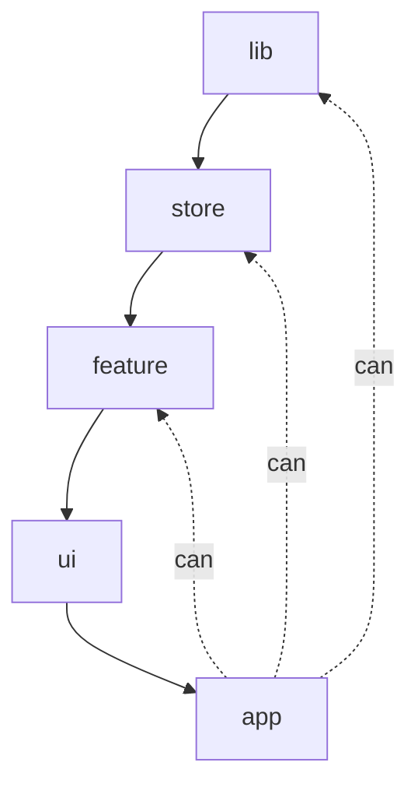

# youngro Monorepo

本仓库基于 Turborepo 与 pnpm 搭建，当前已采用“单向依赖分层”并启用 ESLint 边界规则来约束包之间的引用。

## Using this example

Run the following command:

```sh
npx create-turbo@latest
```

## What's inside?

当前包含以下应用与包：

### Apps and Packages

- `docs`: 基于 [Next.js](https://nextjs.org/) 的文档应用
- `web`: 基于 [Next.js](https://nextjs.org/) 的 Web 应用
- `@repo/ui`: 共享 UI 组件库（只从 `dist` 作为公共入口导出）
- `@repo/eslint-config`: 共享 ESLint 配置（已包含依赖边界与 import 约束）
- `@repo/typescript-config`: 共享 TypeScript 配置
- `@youngro/store-card`: 领域 Store 与类型定义
- `@youngro/feature-youngro-card`: 领域 Feature（UI 组合逻辑）

Each package/app is 100% [TypeScript](https://www.typescriptlang.org/).

### Utilities

- [TypeScript](https://www.typescriptlang.org/): 静态类型检查
- [ESLint](https://eslint.org/): 代码规范（含依赖边界）
- [Prettier](https://prettier.io): 代码格式化

## 架构与依赖边界

分层模型采用自上而下单向依赖：



约束原则：

- 依赖方向：`lib → store → feature → ui → app`（单向，不可反向依赖）
- 只允许通过包“公共入口”导入，禁止跨包深层导入他包的 `src/` 或 `dist/`
- `@repo/ui` 等包仅从 exports 显式暴露的入口导入

对应规则（已在 `@repo/eslint-config` 启用）：

- `boundaries/element-types`：限制包层级依赖方向
- `no-restricted-imports`：禁止导入 `@youngro/**/src/**` 与 `@youngro/**/dist/**`（`@repo/**` 同理）
- `import/no-cycle`、`import/no-extraneous-dependencies`：导入卫生

## 运行与开发

### Build

To build all apps and packages, run the following command:

```
cd my-turborepo

# With [global `turbo`](https://turborepo.com/docs/getting-started/installation#global-installation) installed (recommended)
turbo build

# Without [global `turbo`](https://turborepo.com/docs/getting-started/installation#global-installation), use your package manager
npx turbo build
yarn dlx turbo build
pnpm exec turbo build
```

You can build a specific package by using a [filter](https://turborepo.com/docs/crafting-your-repository/running-tasks#using-filters):

```
# With [global `turbo`](https://turborepo.com/docs/getting-started/installation#global-installation) installed (recommended)
turbo build --filter=docs

# Without [global `turbo`](https://turborepo.com/docs/getting-started/installation#global-installation), use your package manager
npx turbo build --filter=docs
yarn exec turbo build --filter=docs
pnpm exec turbo build --filter=docs
```

### Develop

To develop all apps and packages, run the following command:

```
cd my-turborepo

# With [global `turbo`](https://turborepo.com/docs/getting-started/installation#global-installation) installed (recommended)
turbo dev

# Without [global `turbo`](https://turborepo.com/docs/getting-started/installation#global-installation), use your package manager
npx turbo dev
yarn exec turbo dev
pnpm exec turbo dev
```

You can develop a specific package by using a [filter](https://turborepo.com/docs/crafting-your-repository/running-tasks#using-filters):

```
# With [global `turbo`](https://turborepo.com/docs/getting-started/installation#global-installation) installed (recommended)
turbo dev --filter=web

# Without [global `turbo`](https://turborepo.com/docs/getting-started/installation#global-installation), use your package manager
npx turbo dev --filter=web
yarn exec turbo dev --filter=web
pnpm exec turbo dev --filter=web
```

### Remote Caching

> [!TIP]
> Vercel Remote Cache is free for all plans. Get started today at [vercel.com](https://vercel.com/signup?/signup?utm_source=remote-cache-sdk&utm_campaign=free_remote_cache).

Turborepo can use a technique known as [Remote Caching](https://turborepo.com/docs/core-concepts/remote-caching) to share cache artifacts across machines, enabling you to share build caches with your team and CI/CD pipelines.

By default, Turborepo will cache locally. To enable Remote Caching you will need an account with Vercel. If you don't have an account you can [create one](https://vercel.com/signup?utm_source=turborepo-examples), then enter the following commands:

```
cd my-turborepo

# With [global `turbo`](https://turborepo.com/docs/getting-started/installation#global-installation) installed (recommended)
turbo login

# Without [global `turbo`](https://turborepo.com/docs/getting-started/installation#global-installation), use your package manager
npx turbo login
yarn exec turbo login
pnpm exec turbo login
```

This will authenticate the Turborepo CLI with your [Vercel account](https://vercel.com/docs/concepts/personal-accounts/overview).

Next, you can link your Turborepo to your Remote Cache by running the following command from the root of your Turborepo:

```
# With [global `turbo`](https://turborepo.com/docs/getting-started/installation#global-installation) installed (recommended)
turbo link

# Without [global `turbo`](https://turborepo.com/docs/getting-started/installation#global-installation), use your package manager
npx turbo link
yarn exec turbo link
pnpm exec turbo link
```

## Useful Links

Learn more about the power of Turborepo:

- [Tasks](https://turborepo.com/docs/crafting-your-repository/running-tasks)
- [Caching](https://turborepo.com/docs/crafting-your-repository/caching)
- [Remote Caching](https://turborepo.com/docs/core-concepts/remote-caching)
- [Filtering](https://turborepo.com/docs/crafting-your-repository/running-tasks#using-filters)
- [Configuration Options](https://turborepo.com/docs/reference/configuration)
- [CLI Usage](https://turborepo.com/docs/reference/command-line-reference)

## 图标规范与用法

- 系统图标：统一使用 `@repo/ui` 的 `Icon` 搭配 `lucide-react`，通过 `text-*` 控制颜色、`size` 控制尺寸。
- 品牌/Logo：使用 `@repo/ui` 的 `BrandLogo` 或原生 ``；SVG 资源不使用 `next/image`。
- Lint 约束：
  - 禁止 `<Image src="*.svg"/>`（会触发 ESLint 报错）。
  - ``/`BrandLogo` 必须提供 `alt` 文本（无障碍要求）。

示例：

```tsx
import { Icon, BrandLogo } from "@repo/ui";
import { Check } from "lucide-react";

<Icon icon={Check} size="sm" className="text-muted-foreground" aria-label="ok" />

<BrandLogo srcLight="logo-light.svg" srcDark="logo-dark.svg" alt="Brand" width={180} height={38} />
```
